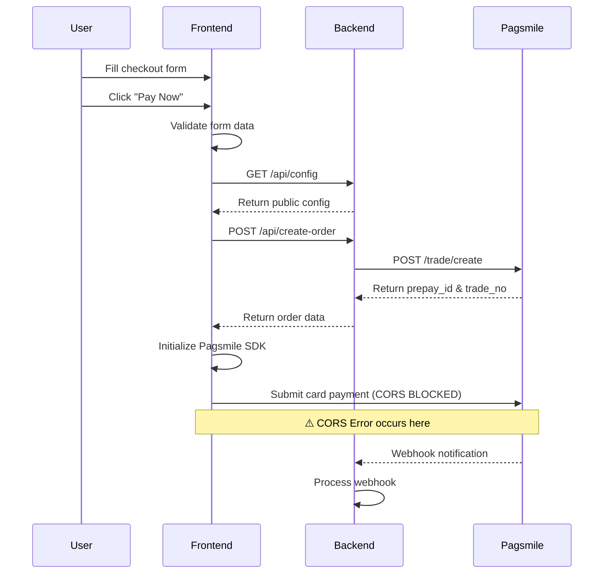

# Pagsmile Credit Card Payment Integration

<div align="center">


A complete credit card payment integration using Pagsmile Payment Gateway with responsive design and multi-language support.

[Features](#features) • [Quick Start](#quick-start) • [API Documentation](#api-endpoints) • [Troubleshooting](#troubleshooting)

</div>

---

## 📋 Table of Contents

- [Overview](#overview)
- [Features](#features)
- [Tech Stack](#tech-stack)
- [Project Structure](#project-structure)
- [Prerequisites](#prerequisites)
- [Quick Start](#quick-start)
- [Environment Variables](#environment-variables)
- [Payment Flow](#payment-flow-explanation)
- [API Endpoints](#api-endpoints)
- [Troubleshooting](#troubleshooting)
- [Known Issues](#known-issues)
- [Next Steps](#next-steps--improvements)
- [Contact](#contact)

---

## 🎯 Overview

This project is a full-stack implementation of credit card payment processing using the **Pagsmile Payment Gateway**. It features a modern, responsive checkout interface with support for both Portuguese and English languages, comprehensive form validation, and real-time payment processing.

The application consists of:
- **Backend**: Express.js server handling API requests, order creation, and webhook notifications
- **Frontend**: Responsive checkout form with Pagsmile SDK integration
- **Payment Gateway**: Pagsmile API for secure payment processing in Brazil (BRL)

**Current Status**: ⚠️ Integration is 95% complete. The only blocker is a CORS issue when submitting card payments through the Pagsmile SDK (see [Known Issues](#known-issues)).

---

## ✨ Features

### Implemented ✅
- ✅ **Responsive Design**: Optimized for mobile, tablet, and desktop (320px to 4K)
- ✅ **Multi-language Support**: Portuguese (PT-BR) and English (EN-US)
- ✅ **Real-time Input Formatting**: CPF, phone numbers, credit cards, ZIP codes
- ✅ **Client-side Validation**: Form validation before API calls
- ✅ **Order Creation**: Complete integration with Pagsmile order API
- ✅ **Transaction Status Query**: Real-time transaction status checking
- ✅ **Webhook Handling**: Receives payment notifications from Pagsmile
- ✅ **Modern UI/UX**: Pagsmile brand colors and professional design
- ✅ **CORS Proxy**: Backend proxy to handle cross-origin requests

### In Progress 🚧
- ⚠️ **Payment Submission**: Blocked by CORS policy (requires Pagsmile team support)
- 🔄 **3D Secure (3DS)**: Ready for testing once CORS is resolved

---

## 🛠 Tech Stack

### Backend
| Technology | Version | Purpose |
|-----------|---------|---------|
| Node.js | ≥18.0.0 | Runtime environment |
| Express.js | ^4.18.2 | Web framework |
| Axios | ^1.6.0 | HTTP client for Pagsmile API |
| Body-parser | ^1.20.2 | Request body parsing |
| CORS | ^2.8.5 | Cross-origin resource sharing |
| Dotenv | ^16.3.1 | Environment variable management |

### Frontend
| Technology | Purpose |
|-----------|---------|
| HTML5 | Semantic markup |
| CSS3 | Responsive styling with media queries |
| Vanilla JavaScript | Client-side logic (no frameworks) |
| Pagsmile SDK | Payment gateway integration |
| Google Fonts (Poppins) | Typography |

### Payment Gateway
- **Provider**: Pagsmile
- **SDK Version**: Latest (pagsmile.min.js)
- **Region**: Brazil (BRA)
- **Currency**: BRL (Brazilian Real)
- **Environment**: Production (`gateway.pagsmile.com`)

---

## 📁 Project Structure

```
credit-card-integration/
├── public/
│   └── checkout.html              # Frontend checkout page (1390 lines)
├── pagsmile-express-backend.js    # Backend server (507 lines)
├── .env                           # Environment variables (not in repo)
├── .gitignore                     # Git ignore rules
├── package.json                   # Node.js dependencies
├── package-lock.json              # Dependency lock file
└── README.md                      # This file
```

### File Descriptions

| File | Lines | Description |
|------|-------|-------------|
| `pagsmile-express-backend.js` | 507 | Express server with API routes, Pagsmile integration, webhook handler, and CORS proxy |
| `public/checkout.html` | 1390 | Complete checkout page with responsive design, i18n support, form validation, and Pagsmile SDK integration |
| `.env` | 6 | Configuration file for API credentials (create from template below) |

---

## 📦 Prerequisites

Before running this project, ensure you have:

- **Node.js** ≥18.0.0 ([Download](https://nodejs.org/))
- **npm** ≥9.0.0 (comes with Node.js)
- **Pagsmile Account** with API credentials
- **Terminal/Command Line** access

### Pagsmile Credentials Required
You need to obtain the following from your Pagsmile dashboard:
1. `APP_ID` - Your application identifier
2. `SECURITY_KEY` - Secret key for API authentication
3. `PUBLIC_KEY` - Public key for SDK initialization

---

## 🚀 Quick Start

### 1. Clone the Repository

```bash
git clone <repository-url>
cd credit-card-integration
```

### 2. Install Dependencies

```bash
npm install
```

This will install:
- express
- axios
- body-parser
- cors
- dotenv

### 3. Configure Environment Variables

Create a `.env` file in the project root:

```bash
touch .env
```

Add your Pagsmile credentials (see [Environment Variables](#environment-variables) section):

```env
PAGSMILE_APP_ID=your_app_id_here
PAGSMILE_SECURITY_KEY=your_security_key_here
PAGSMILE_PUBLIC_KEY=your_public_key_here
PAGSMILE_ENV=prod
PAGSMILE_REGION_CODE=BRA
PORT=3000
```

### 4. Start the Server

```bash
node pagsmile-express-backend.js
```

Expected output:
```
=================================
✅ Servidor rodando na porta 3000
🌍 Ambiente: prod
📍 Região: BRA
🔗 Gateway: https://gateway.pagsmile.com
=================================
```

### 5. Access the Application

Open your browser and navigate to:
```
http://localhost:3000
```

You should see the checkout page with the Pagsmile branding.

---

## 🔐 Environment Variables

Create a `.env` file in the project root with the following variables:

| Variable | Required | Description | Example |
|----------|----------|-------------|---------|
| `PAGSMILE_APP_ID` | ✅ Yes | Your Pagsmile application ID | `17123424291649798` |
| `PAGSMILE_SECURITY_KEY` | ✅ Yes | Secret key for server-to-server authentication | `Pagsmile_sk_xxxxx` |
| `PAGSMILE_PUBLIC_KEY` | ✅ Yes | Public key for frontend SDK initialization | `Pagsmile_pk_xxxxx` |
| `PAGSMILE_ENV` | ✅ Yes | Environment: `sandbox` or `prod` | `prod` |
| `PAGSMILE_REGION_CODE` | ✅ Yes | Region code: `BRA`, `EUP`, or `USA` | `BRA` |
| `PORT` | ❌ No | Server port (default: 3000) | `3000` |

### Example `.env` File

```env
# Pagsmile API Credentials
PAGSMILE_APP_ID=1234567890123456
PAGSMILE_SECURITY_KEY=Pagsmile_sk_test1234567890abcdef1234567890abcdef1234567890abcdef1234567890ab
PAGSMILE_PUBLIC_KEY=Pagsmile_pk_abc123def456ghi789jkl012mno345pqr678stu901vwx234yz
PAGSMILE_ENV=prod
PAGSMILE_REGION_CODE=BRA

# Server Configuration
PORT=3000
```

### Security Notes ⚠️
- **Never commit `.env` to version control**
- The `.gitignore` file already excludes `.env`
- Use different credentials for sandbox and production
- Rotate keys regularly for security

---

## 💳 Payment Flow Explanation

### Complete End-to-End Flow



### Detailed Steps

#### **Step 1: User Input**
- User fills out the checkout form with:
  - Personal information (name, email, phone, CPF)
  - Address (ZIP code, city, state, street)
  - Credit card details (number, expiry, CVV)
  - Order amount

#### **Step 2: Frontend Validation**
- Client-side validation checks:
  - All required fields are filled
  - CPF format is valid (11 digits)
  - Card number length (13-19 digits)
  - Email format
  - Phone format

#### **Step 3: Configuration Retrieval**
```http
GET /api/config
```

**Response:**
```json
{
  "app_id": "1234567890123456",
  "public_key": "Pagsmile_pk_xxxxx",
  "env": "prod",
  "region_code": "BRA"
}
```

#### **Step 4: Order Creation**
```http
POST /api/create-order
Content-Type: application/json

{
  "amount": "1.00",
  "customerInfo": {
    "name": "John Doe Silva",
    "email": "customer@example.com",
    "phone": "5511999999999",
    "cpf": "12345678900",
    "zipCode": "01310100",
    "city": "São Paulo",
    "state": "SP",
    "address": "Avenida Paulista 1000"
  }
}
```

**Backend → Pagsmile API:**
```http
POST https://gateway.pagsmile.com/trade/create
Authorization: Basic <base64(app_id:security_key)>
Content-Type: application/json

{
  "app_id": "1234567890123456",
  "out_trade_no": "ORDER_1764795028241_dzrc01oal",
  "method": "CreditCard",
  "order_amount": "1.00",
  "order_currency": "BRL",
  "subject": "Pagamento de Produto",
  "content": "Descrição do produto ou serviço",
  "trade_type": "API",
  "timestamp": "2025-12-03 17:50:28",
  "notify_url": "http://localhost:3000/api/webhook/payment",
  "return_url": "http://localhost:3000/success",
  "timeout_express": "1d",
  "version": "2.0",
  "buyer_id": "customer@example.com",
  "customer": {
    "identify": {
      "type": "CPF",
      "number": "12345678900"
    },
    "name": "John Doe Silva",
    "email": "customer@example.com",
    "phone": "5511999999999"
  },
  "address": {
    "zip_code": "01310100",
    "state": "SP",
    "city": "São Paulo",
    "street_name": "Avenida Paulista 1000",
    "street_number": "1"
  }
}
```

**Pagsmile Response:**
```json
{
  "code": "10000",
  "msg": "Success",
  "out_trade_no": "ORDER_1234567890123_abc123xyz",
  "trade_no": "2025120312345678901",
  "prepay_id": "dGVzdFByZXBheUlkRm9yRXhhbXBsZVB1cnBvc2VzT25seQ==-ABC123XYZ"
}
```

#### **Step 5: SDK Initialization**
```javascript
const clientInstance = await Pagsmile.setPublishableKey({
  app_id: "1234567890123456",
  public_key: "Pagsmile_pk_abc123def456ghi789jkl012mno345pqr678stu901vwx234yz",
  env: "prod",
  region_code: "BRA",
  prepay_id: "dGVzdFByZXBheUlkRm9yRXhhbXBsZVB1cnBvc2VzT25seQ==-ABC123XYZ",
  fields: {
    card_name: { id_selector: "card-name" },
    card_number: { id_selector: "card-number" },
    expiration_month: { id_selector: "exp-month" },
    expiration_year: { id_selector: "exp-year" },
    cvv: { id_selector: "card-cvv" }
  }
});
```

#### **Step 6: Payment Submission** ⚠️ **BLOCKED BY CORS**
```javascript
const paymentData = {
  phone: "5511999999999",
  email: "customer@example.com",
  postal_code: "01310100",
  payer_id: "12345678900",
  address: {
    country_code: "BRA",
    zip_code: "01310100",
    state: "SP",
    city: "São Paulo",
    street: "Avenida Paulista 1000"
  }
};

// This call fails due to CORS
const paymentResult = await clientInstance.createOrder(paymentData);
```

**Expected Request (Blocked):**
```http
POST https://gateway.pagsmile.com/api/trade/submit-card-pay?prepay_id=xxx&card_token=xxx
Origin: http://localhost:3000
```

**Actual Response:**
```
Status: 403 Forbidden
Error: CORS policy blocked
```

---

## 📡 API Endpoints

### Backend Endpoints

#### 1. Get Configuration
```http
GET /api/config
```

**Description**: Returns public configuration for frontend SDK initialization.

**Response:**
```json
{
  "app_id": "1234567890123456",
  "public_key": "Pagsmile_pk_xxxxx",
  "env": "prod",
  "region_code": "BRA"
}
```

---

#### 2. Create Order
```http
POST /api/create-order
Content-Type: application/json
```

**Description**: Creates a new payment order with Pagsmile API.

**Request Body:**
```json
{
  "amount": "100.00",
  "customerInfo": {
    "name": "Customer Full Name",
    "email": "customer@example.com",
    "phone": "11999999999",
    "cpf": "12345678900",
    "zipCode": "01001000",
    "city": "São Paulo",
    "state": "SP",
    "address": "Street Name, 123"
  }
}
```

**Success Response (200 OK):**
```json
{
  "success": true,
  "prepay_id": "dWlQbm5sYmMvTkxTcUFDZm5VL1lFQzhPOUtrY0ZBTEVkbTZxaGlGclpXOD0=-9cF61FeB",
  "trade_no": "2025120320503108483",
  "out_trade_no": "ORDER_1764795028241_dzrc01oal"
}
```

**Error Response (400/500):**
```json
{
  "success": false,
  "error": "Error message",
  "sub_error": "Detailed error description"
}
```

---

#### 3. Query Transaction
```http
GET /api/query-transaction/:tradeNo
```

**Description**: Queries the current status of a transaction.

**Parameters:**
- `tradeNo` (path): Pagsmile transaction ID

**Example:**
```http
GET /api/query-transaction/2025120320503108483
```

**Response:**
```json
{
  "code": "10000",
  "msg": "Success",
  "trade_no": "2025120320503108483",
  "out_trade_no": "ORDER_1764795028241_dzrc01oal",
  "method": "CreditCard",
  "trade_status": "INITIAL",
  "order_currency": "BRL",
  "order_amount": 1.00,
  "customer": {
    "identification": {
      "number": "12345678900",
      "type": "CPF"
    },
    "username": "John Doe Silva",
    "email": "customer@example.com",
    "phone": "5511999999999",
    "buyer_id": "customer@example.com"
  },
  "create_time": "2025-12-03 20:28:38",
  "update_time": ""
}
```

**Transaction Statuses:**
| Status | Description |
|--------|-------------|
| `INITIAL` | Order created, payment not submitted |
| `PROCESSING` | Payment is being processed |
| `SUCCESS` | Payment completed successfully |
| `FAILED` | Payment failed |
| `CANCELLED` | Payment cancelled |

---

#### 4. Webhook Handler
```http
POST /api/webhook/payment
Content-Type: application/json
```

**Description**: Receives payment notifications from Pagsmile.

**Request Body (from Pagsmile):**
```json
{
  "trade_no": "2025120320503108483",
  "out_trade_no": "ORDER_1764795028241_dzrc01oal",
  "trade_status": "SUCCESS",
  "order_amount": 1.00,
  "order_currency": "BRL",
  "method": "CreditCard"
}
```

**Response:**
```json
{
  "result": "success"
}
```

**Webhook Signature Verification:**
The webhook includes a `pagsmile-signature` header that should be verified in production.

---

#### 5. CORS Proxy
```http
ALL /pagsmile-proxy/*
```

**Description**: Proxy endpoint to forward requests to Pagsmile API (CORS workaround).

**Example:**
```http
POST /pagsmile-proxy/api/trade/submit-card-pay?prepay_id=xxx&card_token=xxx
```

This endpoint forwards the request to:
```http
POST https://gateway.pagsmile.com/api/trade/submit-card-pay?prepay_id=xxx&card_token=xxx
```

---

#### 6. Success Page
```http
GET /success
```

**Description**: Displays a success page after payment completion.

**Response**: HTML page with success message and Pagsmile branding.

---

## 🐛 Troubleshooting

### Common Issues and Solutions

#### 1. Server Won't Start

**Error:**
```
Error: Cannot find module 'express'
```

**Solution:**
```bash
npm install
```

---

**Error:**
```
Error: Missing environment variables
```

**Solution:**
- Ensure `.env` file exists in project root
- Verify all required variables are set
- Check for typos in variable names

---

#### 2. CORS Errors in Browser Console

**Error:**
```
Access to XMLHttpRequest blocked by CORS policy
```

**Solution:**
This is a known issue. See [Known Issues](#known-issues) section.

**Temporary Workaround:**
1. Use browser CORS extensions (development only)
2. Wait for Pagsmile team to enable CORS headers

---

#### 3. Order Creation Fails

**Error:**
```json
{
  "code": "40002",
  "msg": "Business Failed",
  "sub_code": "buyer_id",
  "sub_msg": "buyer_id can not be empty."
}
```

**Solution:**
- Ensure customer email is provided
- Check that all required fields in `customerInfo` are filled
- Verify CPF format (11 digits, numbers only)

---

#### 4. Invalid Credentials

**Error:**
```
401 Unauthorized
```

**Solution:**
- Verify `PAGSMILE_APP_ID` and `PAGSMILE_SECURITY_KEY` in `.env`
- Ensure credentials match your Pagsmile dashboard
- Check if using correct environment (sandbox vs prod)

---

#### 5. Port Already in Use

**Error:**
```
Error: listen EADDRINUSE: address already in use :::3000
```

**Solution:**
```bash
# Find process using port 3000
lsof -i :3000

# Kill the process
kill -9 <PID>

# Or use a different port
PORT=3001 node pagsmile-express-backend.js
```

---

#### 6. Form Validation Errors

**Issue:** Form shows "Please fill all fields" even when filled.

**Solution:**
- Check browser console for JavaScript errors
- Clear browser cache (Ctrl+Shift+R)
- Ensure all required fields have values
- Verify CPF has exactly 11 digits

---

#### 7. Language Not Switching

**Issue:** Clicking language toggle doesn't change text.

**Solution:**
- Clear browser cache
- Check browser console for errors
- Verify localStorage is enabled
- Try incognito/private mode

---

## ⚠️ Known Issues

### CORS Error - Payment Submission Blocked

**Status**: 🔴 **Critical Blocker**

**Description:**
When the Pagsmile SDK attempts to submit card payment via `clientInstance.createOrder()`, the browser blocks the request due to CORS policy.

**Error Details:**
```
Request URL: https://gateway.pagsmile.com/api/trade/submit-card-pay
Request Method: OPTIONS (preflight)
Status Code: 403 Forbidden
Error: Access-Control-Allow-Origin header is missing
```

**Root Cause:**
The Pagsmile gateway server does not return required CORS headers:
- `Access-Control-Allow-Origin`
- `Access-Control-Allow-Methods`
- `Access-Control-Allow-Headers`

**Attempted Solutions:**
1. ✅ Implemented backend proxy (`/pagsmile-proxy/*`)
2. ✅ Added XMLHttpRequest interceptor in frontend
3. ✅ Added Fetch API interceptor in frontend
4. ❌ **Result**: SDK still makes direct requests, bypassing interceptors

**Possible Reasons:**
- SDK might use a different HTTP client (not XHR or Fetch)
- SDK might create requests before interceptors are registered
- SDK might use iframes or Web Workers
- SDK might have internal request handling that cannot be intercepted

**Questions for Pagsmile Team:**

1. **CORS Configuration**: Can you enable CORS headers on `gateway.pagsmile.com` for browser-based requests?
   - Required for development: `http://localhost:3000`
   - Required for production: `https://your-domain.com`

2. **Alternative Integration**: Is there a server-to-server API endpoint for card payment submission?
   - This would bypass CORS entirely
   - Backend could handle card tokenization and submission

3. **SDK Configuration**: Does the SDK support:
   - Base URL override?
   - Proxy configuration?
   - Custom HTTP client injection?

4. **Domain Whitelist**: Do we need to whitelist our domain in Pagsmile dashboard?

5. **Documentation**: Is there updated integration documentation for browser-based implementations?

**Impact:**
- ✅ Order creation works
- ✅ Transaction queries work
- ✅ Webhooks work
- ❌ **Card payment submission does not work**

**Next Steps:**
- Contact Pagsmile technical support
- Request CORS enablement or alternative integration method
- Consider server-side card tokenization if available

---

## 🚀 Next Steps / Improvements

### High Priority
1. **Resolve CORS Issue** (Blocker)
   - Work with Pagsmile team to enable CORS headers
   - Or implement server-side card tokenization
   - Or use alternative integration method

2. **Complete Payment Flow Testing**
   - Test successful payments
   - Test failed payments
   - Test 3D Secure authentication
   - Test various card types (Visa, Mastercard, Elo)

3. **Webhook Signature Verification**
   - Implement cryptographic signature validation
   - Prevent unauthorized webhook calls
   - Add replay attack protection

### Medium Priority
4. **Error Handling Enhancement**
   - Add more specific error messages
   - Implement retry logic for failed API calls
   - Add error logging and monitoring

5. **Security Improvements**
   - Add rate limiting
   - Implement CSRF protection
   - Add request validation middleware
   - Sanitize user inputs

6. **Testing**
   - Add unit tests (Jest)
   - Add integration tests
   - Add end-to-end tests (Cypress)
   - Test edge cases and error scenarios

### Low Priority
7. **UI/UX Enhancements**
   - Add loading animations
   - Improve error message display
   - Add payment method icons
   - Implement card type detection

8. **Additional Features**
   - Add payment history page
   - Implement refund functionality
   - Add installment payment options
   - Support multiple currencies

9. **Production Deployment**
   - Set up CI/CD pipeline
   - Configure SSL certificates
   - Set up monitoring and logging
   - Implement backup and recovery

10. **Documentation**
    - Add API documentation (Swagger/OpenAPI)
    - Create developer guide
    - Add code comments
    - Create video tutorials

---

## 📞 Contact

### Developer Information
- **Name**: Development Team
- **Email**: dev-team@example.com
- **Integration Date**: December 2025
- **Pagsmile Environment**: Production (BRA region)

### Pagsmile Support
For technical support regarding Pagsmile API:
- **Documentation**: [Pagsmile Docs](https://docs.pagsmile.com)
- **Support Email**: support@pagsmile.com
- **Dashboard**: [Pagsmile Dashboard](https://dashboard.pagsmile.com)

### Repository
- **GitHub**: `<repository-url>`
- **Issues**: `<repository-url>/issues`

---

## 📄 License

This project is licensed under the MIT License.

---

## 🙏 Acknowledgments

- **Pagsmile** for providing the payment gateway API
- **Express.js** community for the excellent web framework
- **Google Fonts** for the Poppins typeface

---

<div align="center">

**Made with ❤️ for Pagsmile Integration**

⭐ Star this repo if you find it helpful!

</div>
